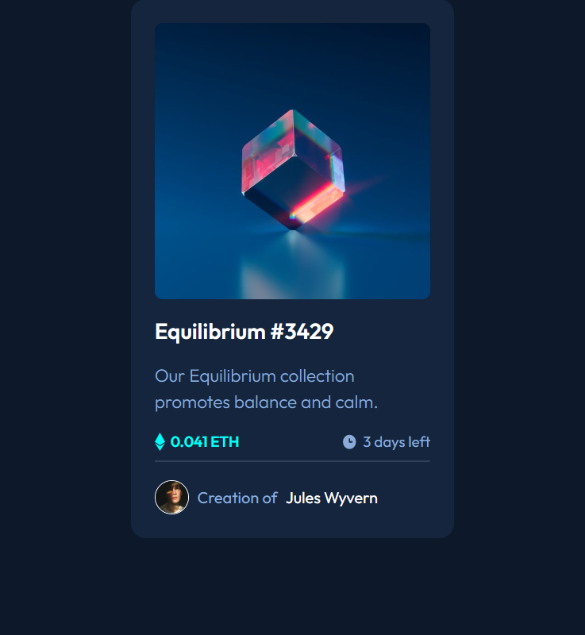

# Frontend Mentor - NFT preview card component solution

This is a solution to the [NFT preview card component challenge on Frontend Mentor](https://www.frontendmentor.io/challenges/nft-preview-card-component-SbdUL_w0U). Frontend Mentor challenges help you improve your coding skills by building realistic projects.

## Table of contents

- [Overview](#overview)
  - [The challenge](#the-challenge)
  - [Screenshot](#screenshot)
  - [Links](#links)
- [My process](#my-process)
  - [Built with](#built-with)
- [Author](#author)

## Overview

### The challenge

NFT preview card component with React and CSS Modules.

### Screenshot

### Links

- Solution URL: [GitHub](https://github.com/Giorgi-Jalali/nft-preview-card-component-react)
- Live Site URL: [GitHub Pages](http://giorgi-jalali.github.io/nft-preview-card-component-react)

## My process

### Built with

- [React](https://reactjs.org/) - JS library
- [CSS Modules](https://github.com/css-modules/css-modules) - For styles

## Author

- LinkedIn - [Giorgi Jalali](https://www.linkedin.com/in/giorgi-jalali-0336b8225/)
